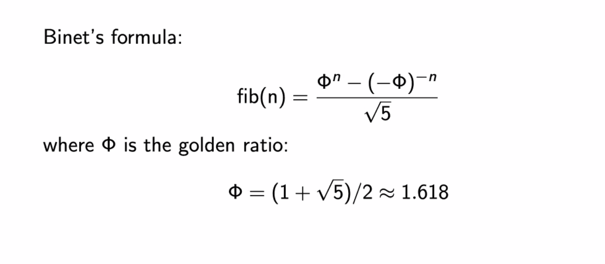

# Dynamic Programming 2

## Combinatronics
## FIb
Rama de las matematicas discretas (ints,graphs,arboles) 
Contar maneras, Cuantas...  
 
La solución es muy corta pero derivar la fórmula toma tiempo. 
Veremos 3 conceptos: Fibonacci, Numeros binomiales, Numeros catalanes.
 
<i>
    Fib 
    <ul>
        <li>DP: O(n)</li>
        <li>Binets formula: O(1) Pierde exactitud en 24</li>
    </ul>
    
</i>

## Coef Binomiales
nCk = n!/(k!(n-k)!)
 

## Catalan
Cat(n) = 2nCn/(n+1)
 
 
Clasico: encuentra el numero de arboles binarios distintos de n nodos.
  
Clasico: cuantas expresiones conteniendo n pares de parentesis que se cierran en una sola vez.
  
Numero de maneras en que un poligono convexo (aquel que todos sus angulos internos son menores o iguales a 180 grados) de n+2 lados puede ser formado.
ejemplo: pentagono -> 5 lados, 
n+2 = 5; n = 3;
ans = Cat(3);
  
Grid de izquierda a derecha, de abajo hacia arriba por debajo de la diagonal. Usando distancias manhattan
 

## Probabilidades Theory

## DP Con strings
Longest String Subsequence & Align String 
Ambos estuvieron faciles de entender 
Se parecen mucho a los problemas de Edit Distance

## DP With Bitmask

### Forming Quiz Teamz

# Parametros comúnes para programación dinámica

## Free Parenthesis

