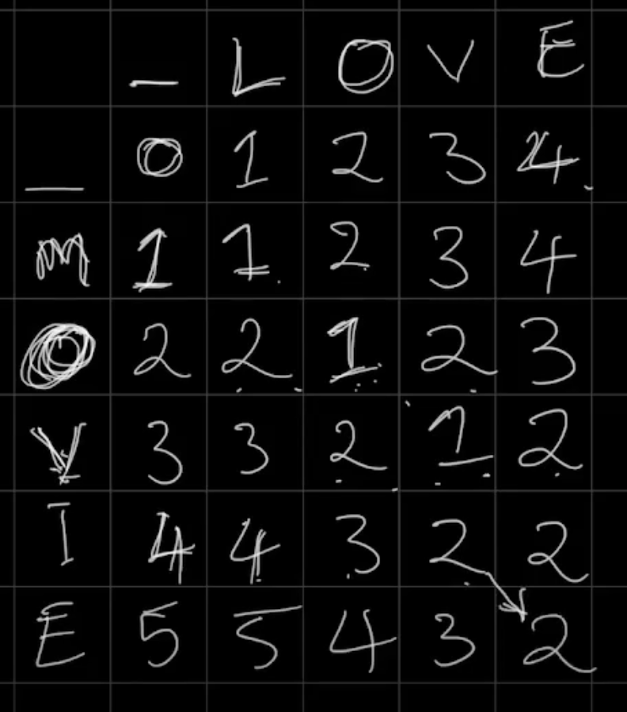
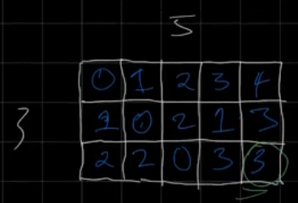
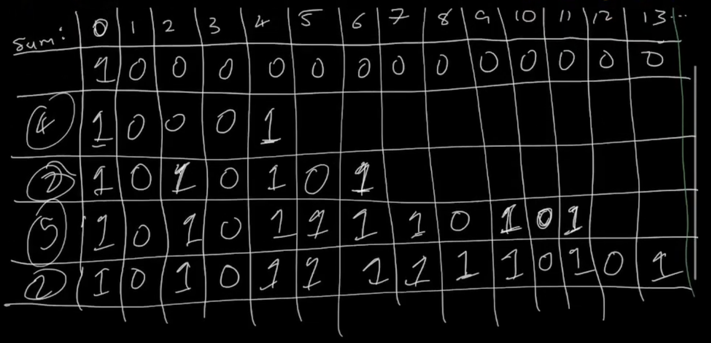
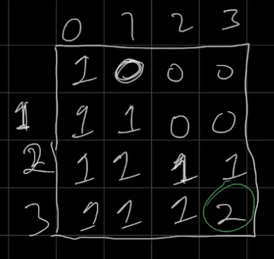
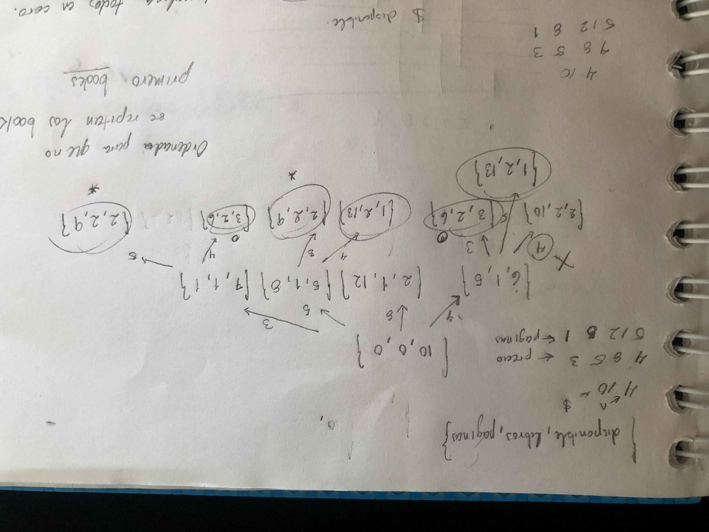
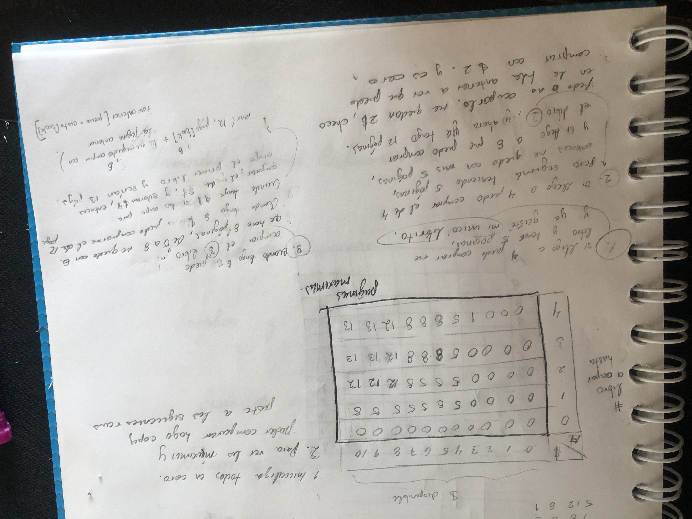
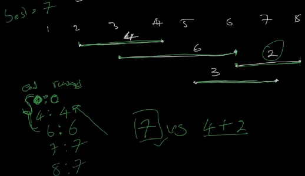

# Dynamic Problems Description
## Edit Distance (Bottom - Up porque partimos de los casos en donde hay un empty string en cualquiera de los dos)
Dado dos palabras hay que dar el número minimo de costo de cambios que hay que hacer para formar la otra cadena. Las operaciones admitidas eran 
<ul>
  <li>Add ()</li>
  <li>Replace ()</li>
  <li>Remove (izquierda)</li>
</ul>
Y al final agregamos +1 debido al movimiento que nos encontramos, si dos letras en el mismo indice, pues solo concidera el menor procedimiento de la letra anterior. 

## Rectangle cutting (Bottom - Up)
Dado dos numeros, que son el tamaño de la matriz. Debes de dar el <b>mínimo</b> número de cortes de tal forma que te queden puros cuadrados. <i> Cabe recalcar que un cuadrado puede ser de nxm si son las mismas (P.e. 5x5). Por lo tanto hay 0 formas porque ya es un cuadrado.</i> 
De igual manera nota que la matriz entonces tiene una diagonal con ceros y la triangular inferior es la misma que la triangular superior. Eso se verifica en el codigo.
 

## MoneySums
Dado un conjunto de números debemos obtener todas las posibles sumas de dichos numeros ordenados, es por eso que se utiliza un set. 
Al final, los numeros que tengan un 1 son las sumas posibles que se pueden obtener usando las monedas. Notas: Se itera por cada moneda.
 
  

## TwoSets II
Dado un numero n , debemos calcular el # de maneras que se puede obtener ese numero
dividiendo los numeros de 1 a n entre 2. Por ejemplo, para n = 4 conjunto1 = {2,3} conjunto2 = {4,1}.  
Ambos suman 5, pero ojo, puede ser que el conjunto salga al revés, por eso al final la respuesta se <b> divide entre 2</b> PERO DE FORMA MODULO INVERSO.
 
Es un caso similar al de MONEYSUMS. 

  

## Book Shop (0/1 Snapsack problem)

  

  

## LIS (Longest Increasing Subsequence)
Este es un problema típico de entrevista en el que tienes que encontrar dado un arreglo 
al subarray creciente más largo y dar su length.
Para esto hay que ir iterando por cada uno de los elementos en un array pero
ocupamos un array extra llamado LIS, que irá guardando los valores de la LIS, mediante <b>
lower_bound</b> busca donde debería de ir ese numero (Si no lo encontramos debemos solo agregarlo al final con un push_back debido a que entonces el current es el mayor),después  lo ponemos en el indice ( lower-LIS.begin() ).  
Nota: Aquí no importa el orden de los numeros, solo la subsequencia. 

 

## Projects
Debemos ordenar el conjunto de datos por fecha de terminación, para evitar colisiones
en un futuro.   Se ocupa un mapa para guardar <terminación, reward>. Se observa el current end de la tarea, y debo encontrar el projecto anteror que no colisione con mi current (<b>lower_bound en el map con el start de la current project</b>). Y voy igualando una variable llamada maxReward a lo que se ha echo de máximo.
Complejidad: O(nlogn) Porque se busca para cada una de los items, y se hace una búsqueda
binaria.

  
 

## Counting Numbers
En este problema se nos pide calcular los números válidos para los que se cumple que
<ul>
  <li>El número de dígitos adjacentes
  no es el mismo</li>
</ul>
entre un rango de números dado a y b
 
Por lo que, se podría decir que la solución es: 

<code>solucion = solucion(b) - solucion(a-1)</code>

Por ejemplo, si tenemos una secuecia 0 1 2 3 4 y tenemos un rango a= 2, b=4, entonces

<b>0 1</b> 2 3 4

<b>0 1</b> 2 3 4

 
Y de esta forma tenemos la solución en un rango de 2 a 4.
 
Si tenemos un digito de inicio, por ejemplo digamos:

<u>3</u> _

Podríamos poner en el otro digito desde 0 hasta 9, pero no es válido, porque el número 3 no podría estar, entonces tenemos en total <u>8</u> posibles números. (En progra, de 0 a 9)
 
Por lo que se deduce que para 1 digito = 9, para 2 digitos = 9x9, para 3 digitos = 9x9x9, etc.
 

<u>9</u> x <u>9</u> . . .  

<u>9</u> x <u>9</u> x <u>9</u> . . .  

dp[0] = 9 
dp[1] = 9x9 
dp[2] = 9x9x9 
dp[3] = 9x9x9x9 
 
Ahora haremos un caso para calcular 321:  

 <u>3</u> <u>2</u> <u>1</u> 

Para empezar sabemos que de cajón tiene todas las posibles combinaciones con 2 digitos, es decir que debemos sumar dp[0], dp[1], dp[2], por lo que nuestra respuesta tendría mientras... 

 <code>ans = dp[0] + dp[1] + dp[2] = 91</code>

Ahora procesamos el número 321:

 <u>3</u> <u>2</u> <u>1</u> 

Procesamos al 3:

 <u>3</u> 2 1 

Como tenemos las posibles combinaciones abajo de él con 3 digitos (1,2 ó cienes y doscientos), y nos queda <b>adelante</b> un número de 2 digitos, que ya habíamos calculado previamente, entonces tenemos las siguientes combinaciones:

 <u>3</u>  2 1 

  2x[9x9] 

  2xdp[2] = 2*81

Ahora procesamos el 2: 
Podemos tener las cobinaciones con el cero y el 1, y un digito restante adelante, lo que generá las siguientes combinaciones

 3 <u>2</u> 1 

 <u>2</u> x [9] 

  2xdp[1] = 18

Para el 1:
Pues solo nos quedan con el cero, y no nos quedan más digitos adelante entonces:

 3 2 <u>1</u> 

 1 

  1xdp[0] = 1

 <code>ans = dp[0] + dp[1] + dp[2] + 2x81 + 18 + 1 = 273</code>

Ahora haremos un caso para calcular 122 :  

 <u>1</u> <u>2</u> <u>2</u> 

Para empezar sabemos que de cajón tiene todas las posibles combinaciones con 2 digitos, es decir que debemos sumar dp[0], dp[1], dp[2], por lo que nuestra respuesta tendría mientras... 

 <code>ans = dp[0] + dp[1] + dp[2] = 91</code>

Ahora procesamos el número 122:

 <u>1</u> <u>2</u> <u>2</u> 

Procesamos al 1:

 <u>1</u> 2 2 

posibles combinaciones abajo de él (0 ó menos de cien), por lo que pasamos al siguiente digito:
  
Ahora procesamos el 2:

 1 <u>2</u> 2  

Este es un caso especial porque si exploro todas las posibilidades debajo de ese 2(0 y 1), colisionaría con el 1, entonces sólo podría hacerlas con el cero:

 1 <u>2</u> 2  

 <u>1</u> x [9] 

  1xdp[1] = 9

Para el 2:
Tenemos al 0 y al 1.

 1 2 <u>2</u> 

 0,1

  2xdp[0] = 1

 <code>ans = 91 + 9 + 2 = 102</code>

Como nos falta incluir al número 122, debido a que el digito 3ro colisiona con el 2do, pues no lo contaremos y romperemos el loop que estemos haciendo.
 
Finalmente:

<code>solucion = solucion(b) - solucion(a-1)</code>

<code>solucion = 273 - 102 = 171</code>

