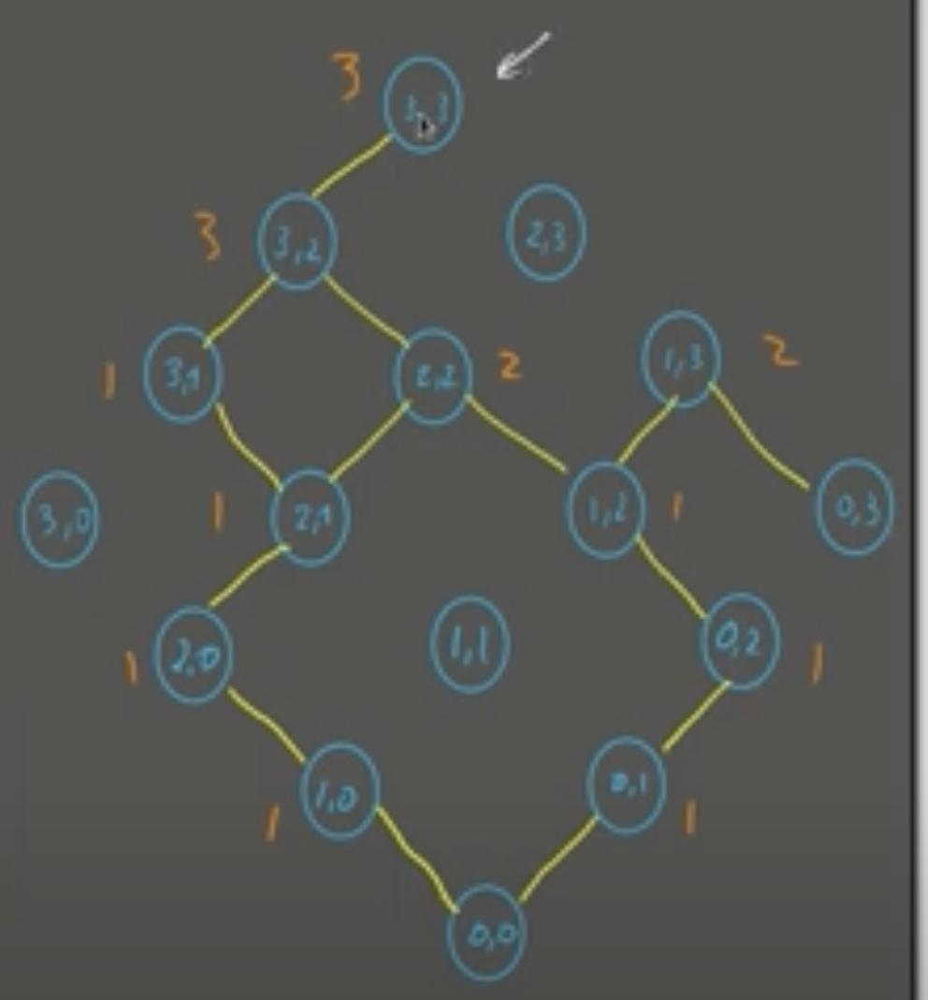

# Explanation
This is the first 2 dimensional dynamic problem that I am going to solve, we need to start with a nxn matrix, where there could be some traps in it.  
And we will sum the possible paths to a counter of paths.  
 
