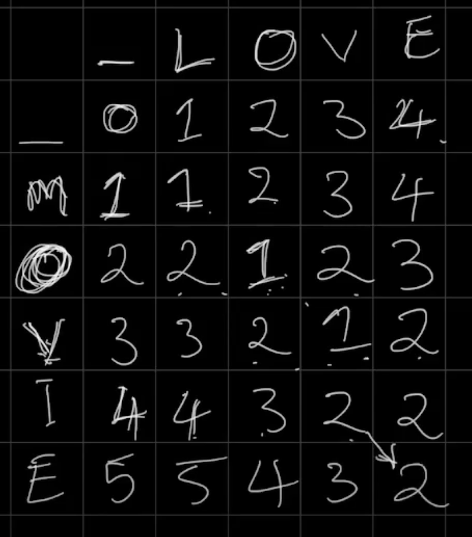
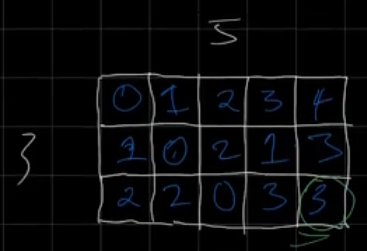
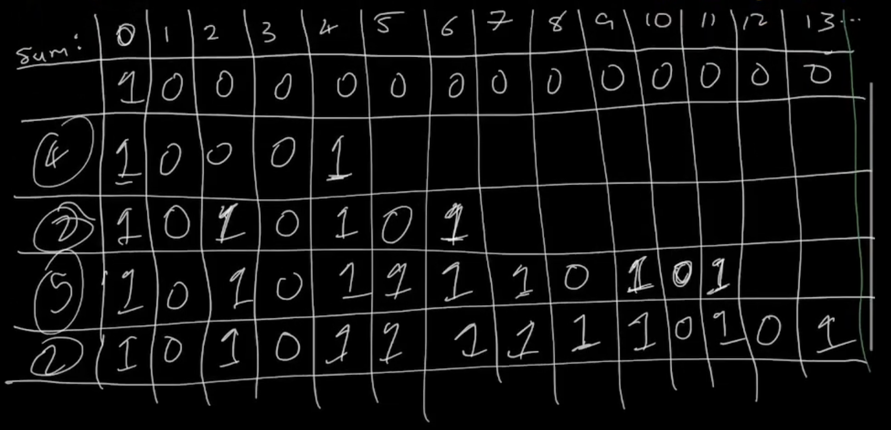
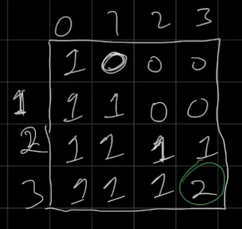
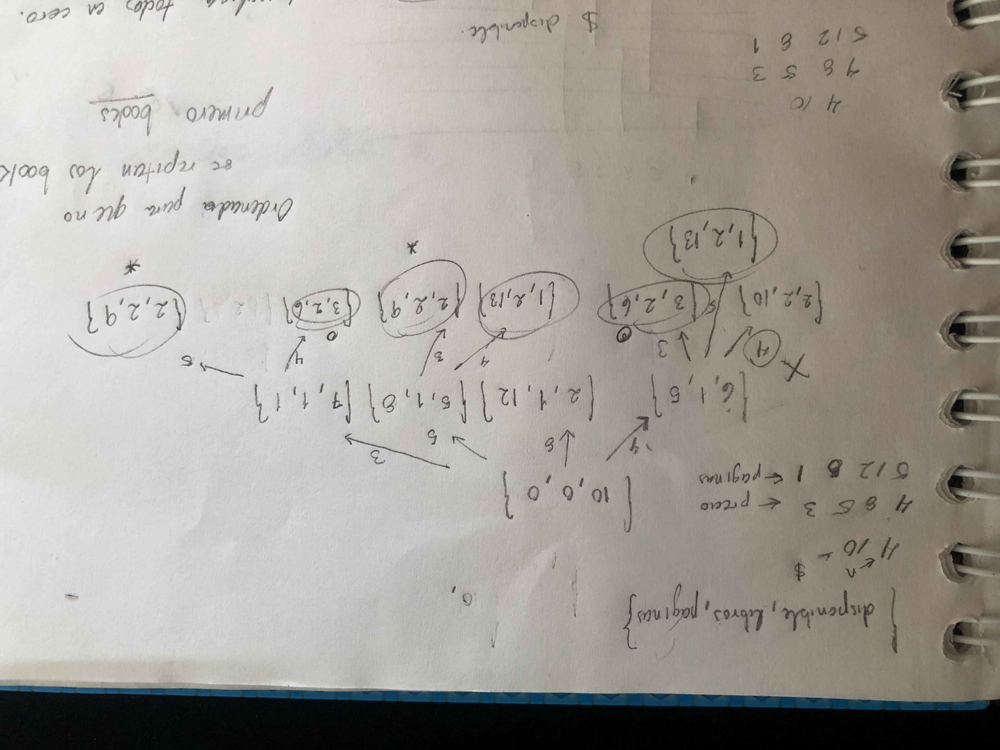
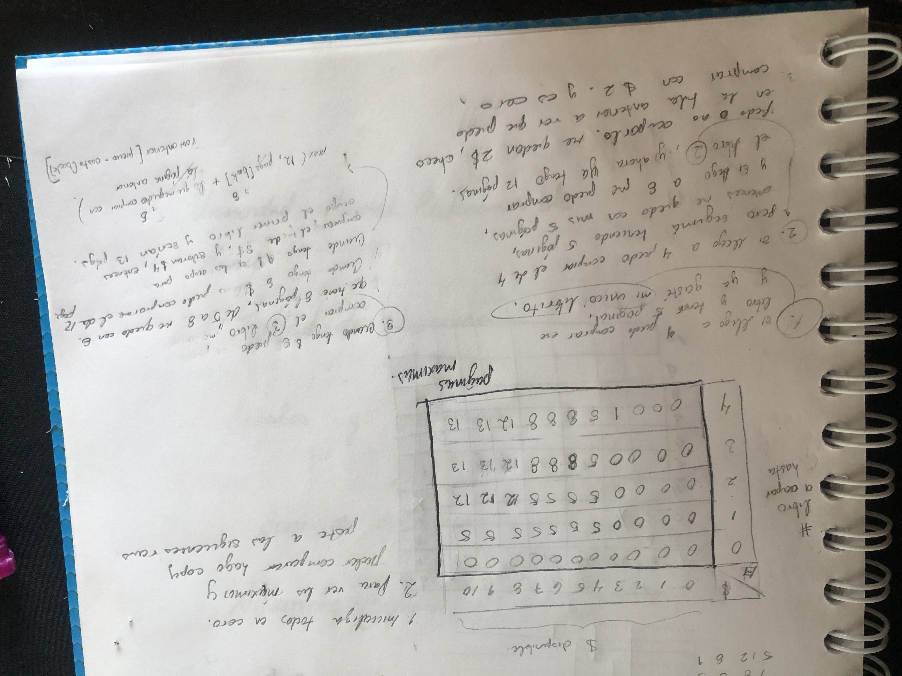

# Dynamic Problems Description
## Edit Distance (Bottom - Up porque partimos de los casos en donde hay un empty string en cualquiera de los dos)
Dado dos palabras hay que dar el número minimo de costo de cambios que hay que hacer para formar la otra cadena. Las operaciones admitidas eran 
<ul>
  <li>Add ()</li>
  <li>Replace ()</li>
  <li>Remove (izquierda)</li>
</ul>
Y al final agregamos +1 debido al movimiento que nos encontramos, si dos letras en el mismo indice, pues solo concidera el menor procedimiento de la letra anterior. 

## Rectangle cutting (Bottom - Up)
Dado dos numeros, que son el tamaño de la matriz. Debes de dar el <b>mínimo</b> número de cortes de tal forma que te queden puros cuadrados. <i> Cabe recalcar que un cuadrado puede ser de nxm si son las mismas (P.e. 5x5). Por lo tanto hay 0 formas porque ya es un cuadrado.</i> 
De igual manera nota que la matriz entonces tiene una diagonal con ceros y la triangular inferior es la misma que la triangular superior. Eso se verifica en el codigo.
 

## MoneySums
Dado un conjunto de números debemos obtener todas las posibles sumas de dichos numeros ordenados, es por eso que se utiliza un set. 
Al final, los numeros que tengan un 1 son las sumas posibles que se pueden obtener usando las monedas. Notas: Se itera por cada moneda.
 
  

## TwoSets II
Dado un numero n , debemos calcular el # de maneras que se puede obtener ese numero
dividiendo los numeros de 1 a n entre 2. Por ejemplo, para n = 4 conjunto1 = {2,3} conjunto2 = {4,1}.  
Ambos suman 5, pero ojo, puede ser que el conjunto salga al revés, por eso al final la respuesta se <b> divide entre 2</b> PERO DE FORMA MODULO INVERSO.
 
Es un caso similar al de MONEYSUMS. 

  

## Book Shop (0/1 Snapsack problem)

  

  

## LIS (Longest Increasing Subsequence

## Projects

Debemos ordenar el conjunto de datos por fecha de terminación, para evitar colisiones
en un futuro.  

Complejidad:O(nlogn) Porque se busca para cada una de los items, y se hace una buscqueda
binaria.

